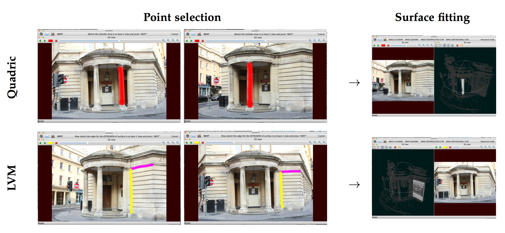
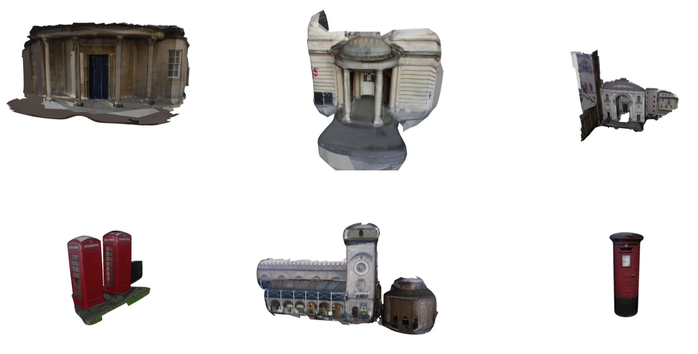

# FacadeReconstruction

## Overview
The code provided in this repository was created for the 'Urban Assets' work package of the 'Outdoor Asset Capture' project at the University of Bath. The project was set up to acquire models of objects in the environment for use in computer graphics.

The software is designed to take a collection of calibrated images and a point cloud, and produce piecewise primitive surfaces from user annotations. The use can either specify a region of points on a quadric surface, or compose a surface from a pair of splines which are fitted to edge points.

**An example of the software with user interactions**

An example of the interface is shown in the image above. The user can either choose to fit a simple quadric surface, such as a cylinder in the top row, or a pair of splines in the bottom row. A collection of annotations are made to identify which points in the point cloud belong to the surface. Finally, the primitive surfaces are produced as shown on the right hand side.

**Final Results**

A selection of completed surfaces are shown in the image above, after a full set of annotations and surface closure.

## Pre-requisites

The software requires the following in order to compile,

* Mac OSX with Qt5.
* OpenCV installed in /usr/local. The homebrew version has been tested and works.

The following libraries are either included with this software, or a submodule. Be sure to take note of their relevant licenses,

* [Eigen](http://eigen.tuxfamily.org). Located in libs/Eigen.
* [VCGlib](http://vcg.isti.cnr.it/vcglib/). Located in libs/vcglib.
* [CuteLogger](https://github.com/dept2/CuteLogger). Located in libs/cutelogger.
* [GLEW](http://glew.sourceforge.net/). Located in libs/glew.

## Installation

First clone the git repository using the command,
> git clone https://github.com/dabeale/FacadeReconstruction

To compile the software either open the project file in the source directory, and compile from Qt Creator, or run,
> ./Build.sh

from the base directory. This script will check for the required pre-requisites before buiding. If the build fails please email me at dabeale@gmail.com and I will try to fix it.

