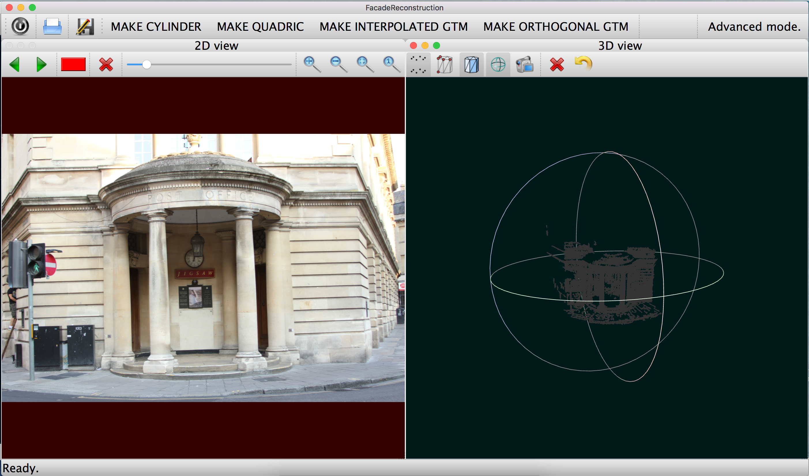
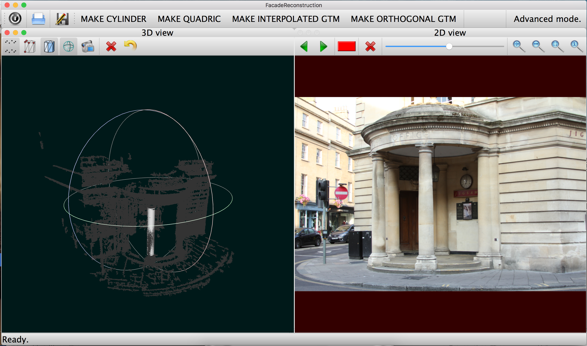
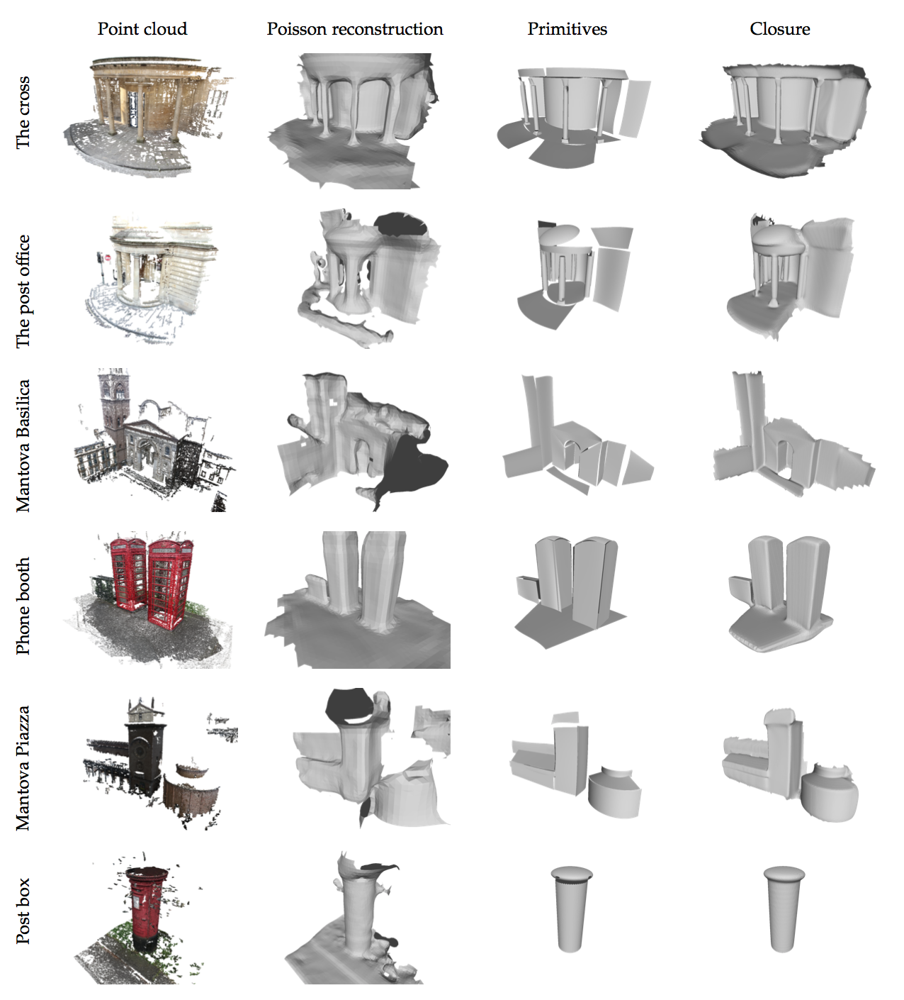

# FacadeReconstruction

## Overview
The code provided in this repository was created for the 'Urban Assets' work package of the 'Outdoor Asset Capture' project at the University of Bath. The project was set up to acquire models of objects in the environment for use in computer graphics.

The software is designed to take a collection of calibrated images and a point cloud, and produce piecewise primitive surfaces from user annotations. The use can either specify a region of points on a quadric surface, or compose a surface from a pair of splines which are fitted to edge points.

###An example of the software with user interactions

An example of the interface is shown in the image above. The user can either choose to fit a simple quadric surface, such as a cylinder in the top row, or a pair of splines in the bottom row. A collection of annotations are made to identify which points in the point cloud belong to the surface. Finally, the primitive surfaces are produced as shown on the right hand side.

The documentation for the library can be found at [dabeale.github.io/FacadeReconstruction](http://dabeale.github.io/FacadeReconstruction).

###Final Results

A selection of completed surfaces are shown in the image above, after a full set of annotations and surface closure.

## Pre-requisites

The software requires the following in order to compile,

* Mac OSX with Qt5.
* OpenCV installed in /usr/local. The homebrew version has been tested and works.

The following libraries are either included with this software, or a submodule. Be sure to take note of their relevant licenses,

* [Eigen](http://eigen.tuxfamily.org). Located in libs/Eigen.
* [VCGlib](http://vcg.isti.cnr.it/vcglib/). Located in libs/vcglib.
* [CuteLogger](https://github.com/dept2/CuteLogger). Located in libs/cutelogger.
* [GLEW](http://glew.sourceforge.net/). Located in libs/glew.

In order to install the post-processing scripts [GNU Octave](https://www.gnu.org/software/octave/) is required. This can either be installed from the website, or using package manager such as [Homebrew](http://brew.sh/). Note that the executable mkoctfile must be on the system path.

## Installation

First clone the git repository using the command,
> git clone --recursive https://github.com/dabeale/FacadeReconstruction

Note that the '--recursive' option is required since the repository contains submodules, such as Eigen, VCGlib, and CuteLogger.

To compile the software either open the project file in the source directory, and compile from Qt Creator, or run,
> ./Build.sh

from the base directory. This script will check for the required pre-requisites before buiding. If the build fails please email me at dabeale@gmail.com and I will try to fix it.

## Example usage
The software requires a point cloud and calibrated set of images in order to run. It will load a file in the Meshlab Project (.mlp) format, which provides the locations of the necessary files and also details the camera matrices. [MeshLab](http://www.meshlab.net/) can be used to create and manipulate these files. In order to provide a usage demonstration an example mlp file and data can be found in the 'data' subdirectory.

Once the code has compiled, open the executable from the 'bin' directory as follows,
> ./GUI

A file input dialogue will appear from which the .mlp file must be chosen. For the purposes of demonstration, open the 'post_office_set_2.mlp' file in the 'data' subdirectory. Once the file has loaded the software will display an interface, as shown below,

Click on the button labelled 'MAKE CYLINDER'. Move the slider above the image to just over half way, and paint over one of the pillars on the entrance of the building. Once this is done, click on the right pointing green arrow once, to select a new view. Paint over the same pillar again. The view should be similar to the one shown below,

Click on the button labelled 'NEXT' in the top left hand corner to return to the main screen. If there are too few views selected, or not enough annotation, the interface will display an error message. The main interface should look like the one below, displaying the point cloud and the surface on at trackball.

The same process is used for fitting an Ellipsoid, or a pair of GTM splines arranged orthogonally or in parallel.

# Results
The results of extracting the primitive surfaces and final closure of the surfaces can be seen in the image below, compared to a Poisson reconstruction on the point cloud. The images were taken from a collection of locations around Bath and Rome.

### Method comparison

